# Pekobot Architecture

This document describes the internal architecture of Pekobot, explaining how the different components work together.

## Table of Contents

1. [High-Level Architecture](#high-level-architecture)
2. [Component Overview](#component-overview)
3. [Data Flow](#data-flow)
4. [Module Details](#module-details)
5. [Agent Lifecycle](#agent-lifecycle)
6. [A2A Protocol](#a2a-protocol)
7. [Memory System](#memory-system)
8. [Identity System](#identity-system)

---

## High-Level Architecture

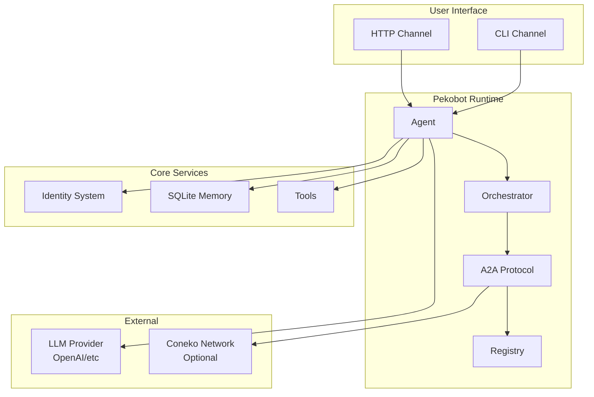

---

## Component Overview

| Component | Purpose | Key Files |
|-----------|---------|-----------|
| **Agent** | Single agent runtime with lifecycle | `src/agent/mod.rs` |
| **Orchestrator** | Multi-agent coordination | `src/agent/mod.rs` |
| **A2A Protocol** | Agent-to-agent messaging | `src/a2a/` |
| **Identity** | DID and key management | `src/identity/` |
| **Memory** | SQLite persistence | `src/memory/` |
| **Providers** | LLM integrations | `src/providers/` |
| **Tools** | Agent capabilities | `src/tools/` |
| **Channels** | User interfaces | `src/channels/` |
| **Coneko** | Network adapter | `src/coneko/` |

---

## Data Flow

### Single Agent Execution

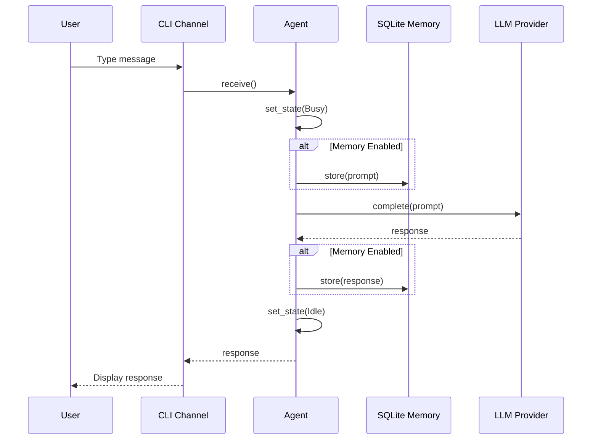

### Multi-Agent Orchestration

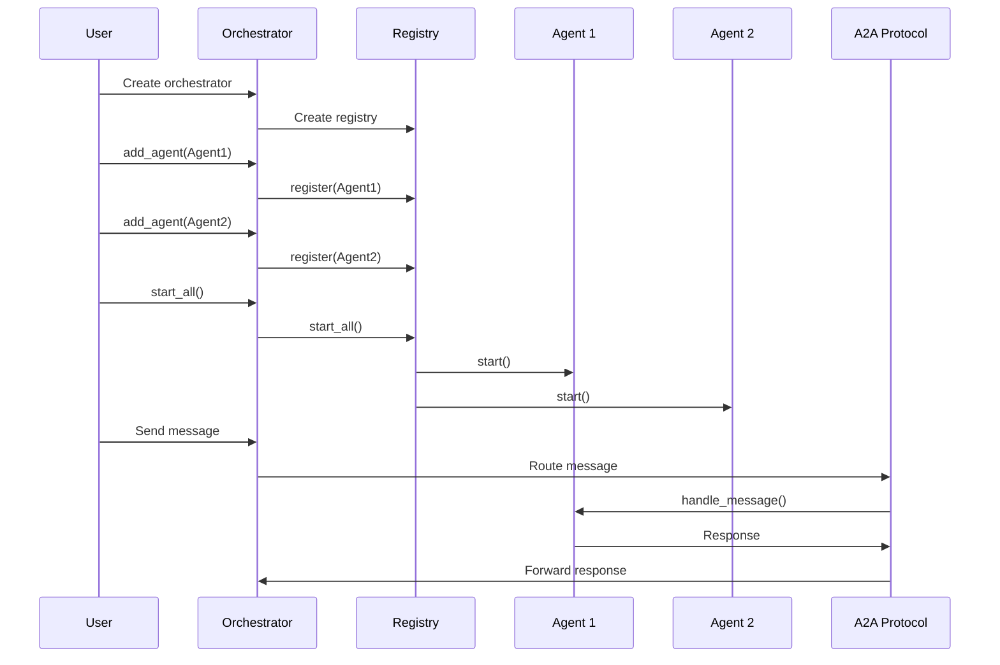

---

## Module Details

### Agent Module

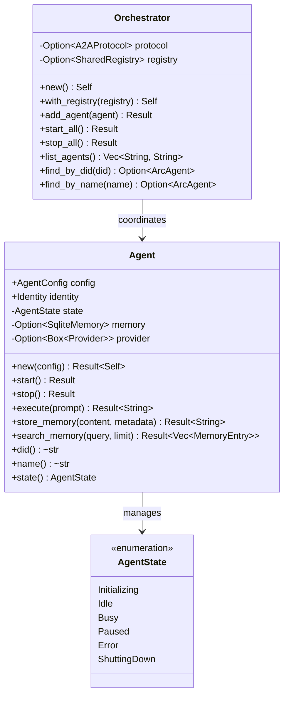

### Identity System

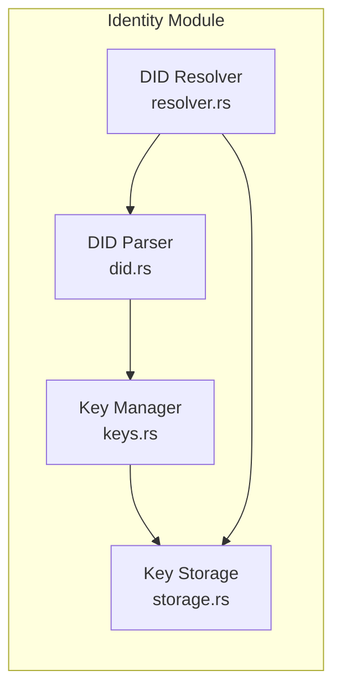

**DID Format:**

```
did:pekobot:{scope}:{tenant}:{identifier}

Examples:
- did:pekobot:local:default:abc123...
- did:pekobot:tenant:acme:def456...
- did:pekobot:global::ghi789...
```

### Memory System

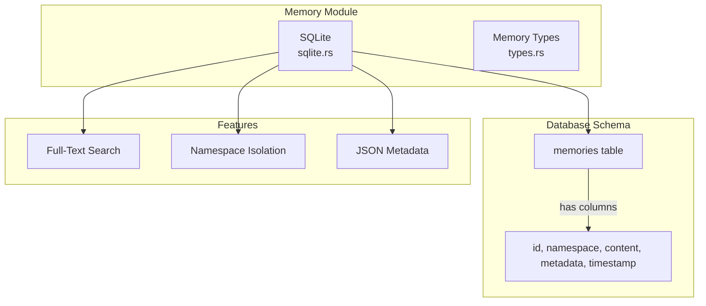

---

## Agent Lifecycle

```mermaid
stateDiagram-v2
    [*] --> Initializing: Agent::new()
    
    Initializing --> Idle: start()
    Initializing --> Error: init_failure
    
    Idle --> Busy: execute()
    Idle --> Paused: pause()
    Idle --> ShuttingDown: stop()
    
    Busy --> Idle: task_complete
    Busy --> Error: task_failure
    Busy --> ShuttingDown: stop()
    
    Paused --> Idle: resume()
    Paused --> ShuttingDown: stop()
    
    Error --> Idle: recover()
    Error --> ShuttingDown: stop()
    
    ShuttingDown --> [*]: cleanup_complete
```

### State Transitions

| From | To | Trigger | Description |
|------|-----|---------|-------------|
| `Initializing` | `Idle` | `start()` | Agent ready for tasks |
| `Idle` | `Busy` | `execute()` | Processing a prompt |
| `Busy` | `Idle` | Task complete | Ready for next task |
| `Idle` | `ShuttingDown` | `stop()` | Graceful shutdown |
| `Busy` | `ShuttingDown` | `stop()` | Emergency shutdown |

---

## A2A Protocol

The Agent-to-Agent (A2A) protocol enables standardized communication between agents.

### Message Types

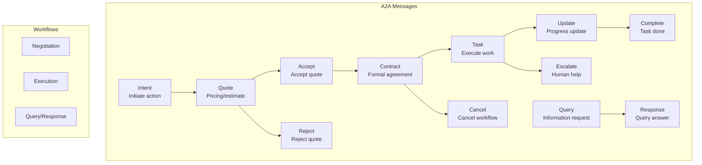

### Registry Architecture

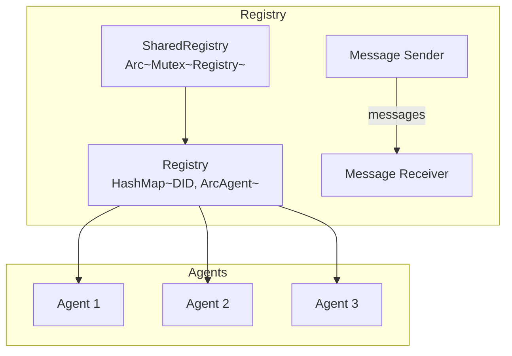

---

## Memory System

### Database Schema

```mermaid
erDiagram
    MEMORY {
        string id PK
        string namespace
        text content
        text metadata JSON
        datetime timestamp
    }
```

### Memory Operations

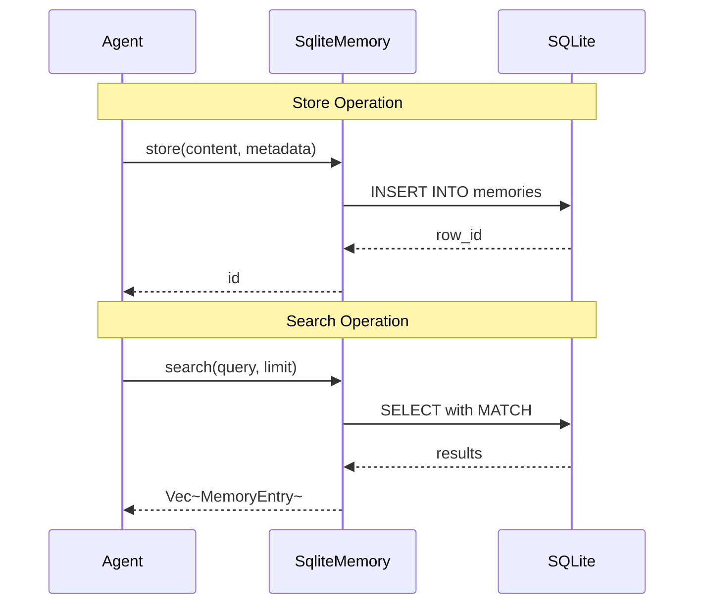

---

## Coneko Integration

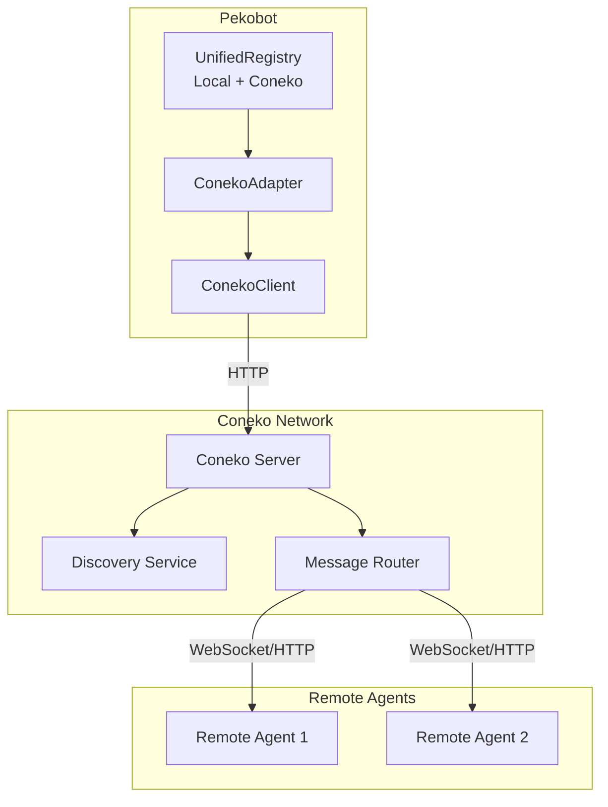

---

## Project Structure

```
pekobot/
├── src/
│   ├── main.rs           # CLI entry point
│   ├── lib.rs            # Library exports
│   ├── agent/            # Agent runtime & orchestrator
│   │   └── mod.rs
│   ├── a2a/              # A2A protocol
│   │   ├── mod.rs
│   │   ├── message.rs    # Message types
│   │   ├── protocol.rs   # Protocol handler
│   │   ├── registry.rs   # Agent registry
│   │   └── flows.rs      # Workflow definitions
│   ├── channels/         # User interfaces
│   │   ├── mod.rs
│   │   ├── cli.rs        # Terminal interface
│   │   └── http.rs       # HTTP webhook
│   ├── coneko/           # Coneko network
│   │   ├── mod.rs
│   │   ├── client.rs     # HTTP client
│   │   └── registry.rs   # Unified registry
│   ├── config/           # Configuration
│   │   └── mod.rs
│   ├── identity/         # DID & keys
│   │   ├── mod.rs
│   │   ├── did.rs        # DID parsing
│   │   ├── keys.rs       # Key management
│   │   ├── storage.rs    # Key storage
│   │   └── resolver.rs   # DID resolution
│   ├── memory/           # SQLite persistence
│   │   ├── mod.rs
│   │   ├── sqlite.rs     # Implementation
│   │   └── types.rs      # Memory types
│   ├── providers/        # LLM integrations
│   │   ├── mod.rs
│   │   ├── traits.rs     # Provider trait
│   │   └── openai.rs     # OpenAI provider
│   ├── tools/            # Agent tools
│   │   ├── mod.rs
│   │   ├── traits.rs     # Tool trait
│   │   ├── http.rs       # HTTP tool
│   │   └── memory_tool.rs # Memory tool
│   └── types/            # Core types
│       ├── mod.rs
│       ├── agent.rs      # Agent config/state
│       ├── config.rs     # General config
│       ├── memory.rs     # Memory types
│       ├── provider.rs   # Provider types
│       └── task.rs       # Task types
├── examples/             # Example code
├── tests/                # Integration tests
└── docs/                 # Documentation
```

---

## Configuration Flow

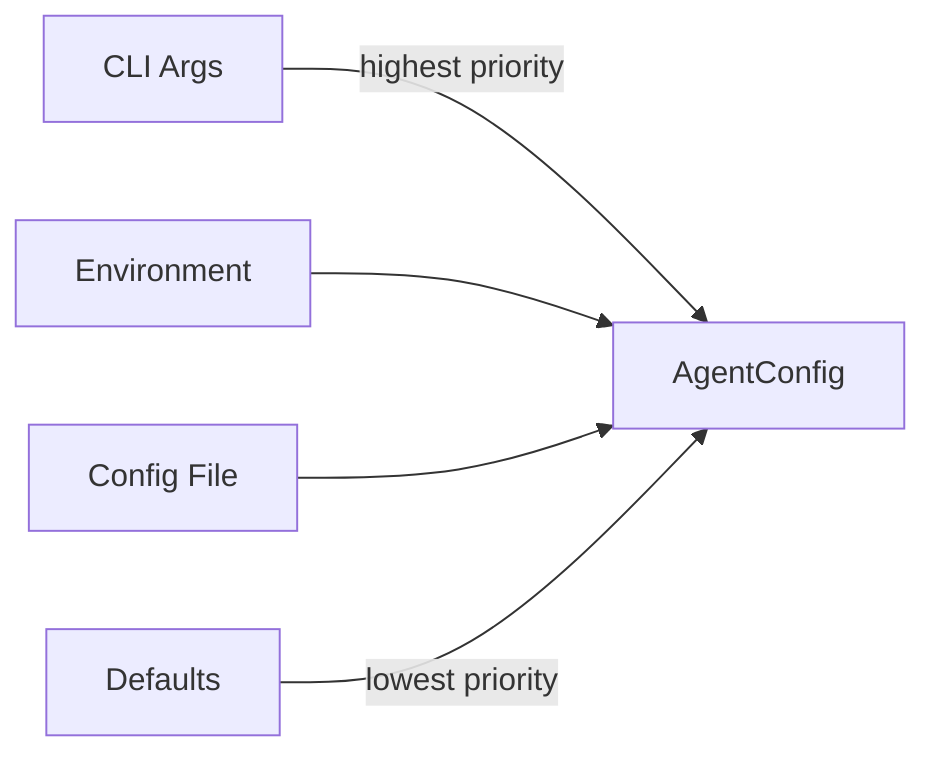

---

## Security Considerations

### Identity

- ed25519 keys for cryptographic identity
- DID-based addressing
- Keys stored in platform-specific secure storage

### Network

- HTTPS required for production
- Authentication tokens for Coneko
- Request timeouts configured

### Memory

- Namespace isolation per agent DID
- SQLite with bundled library
- No sensitive data in logs

---

*For implementation details, see the source code and [API Documentation](API.md)*
