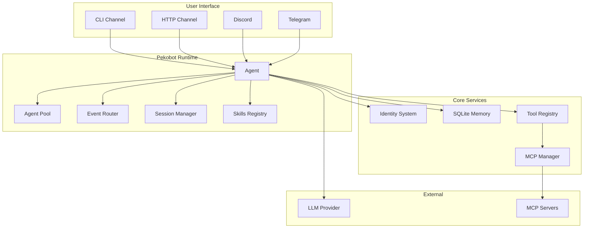
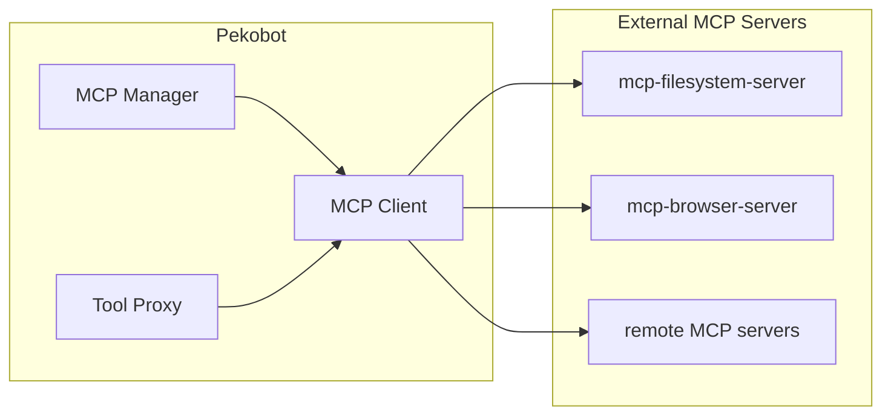
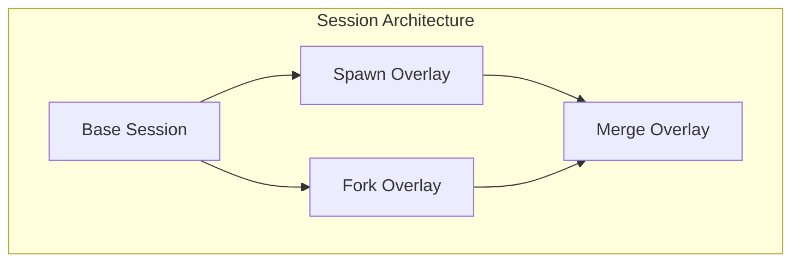
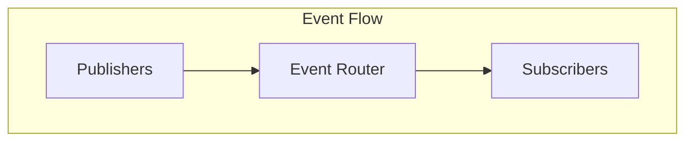
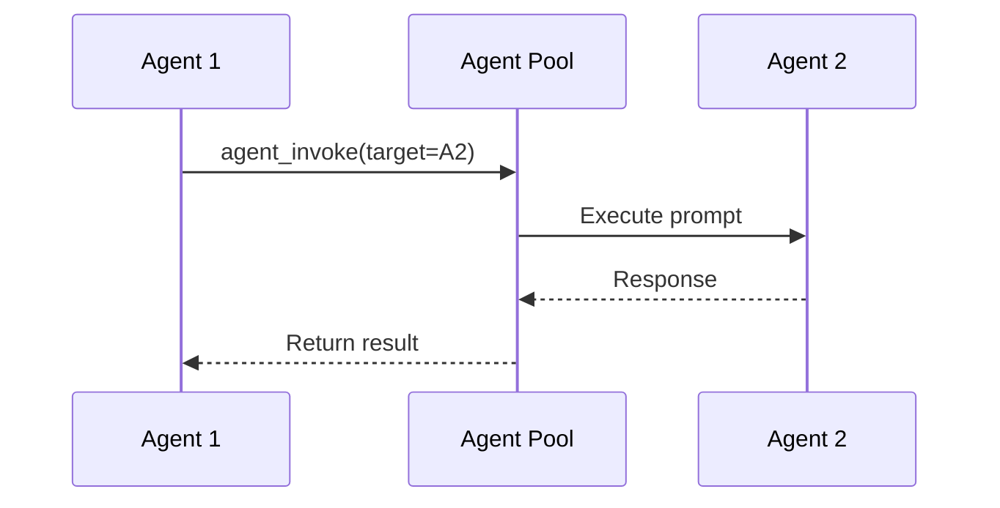
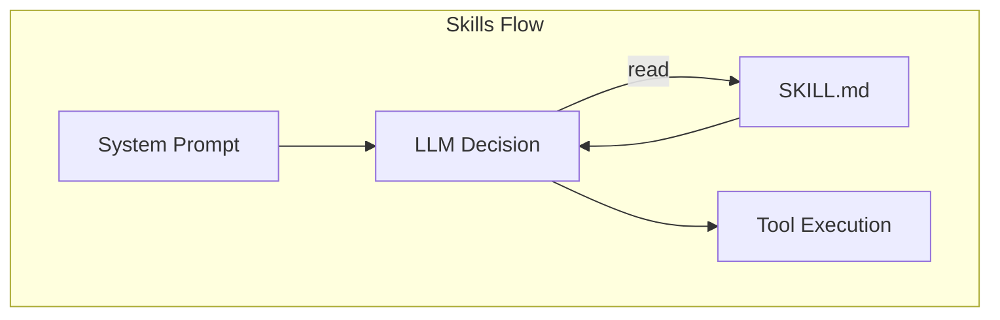
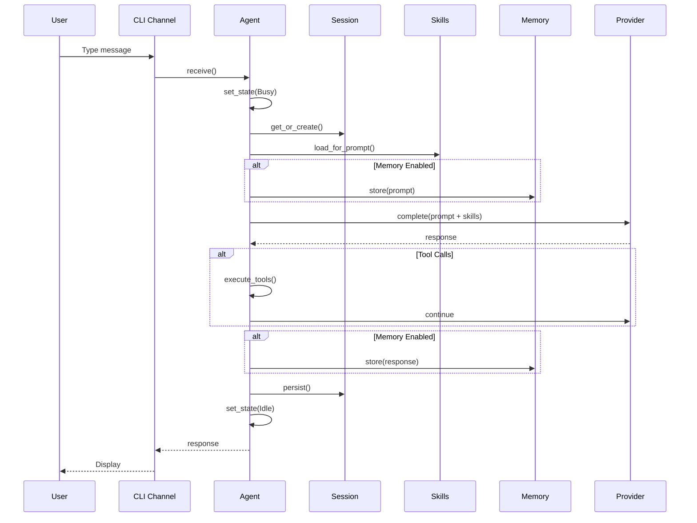
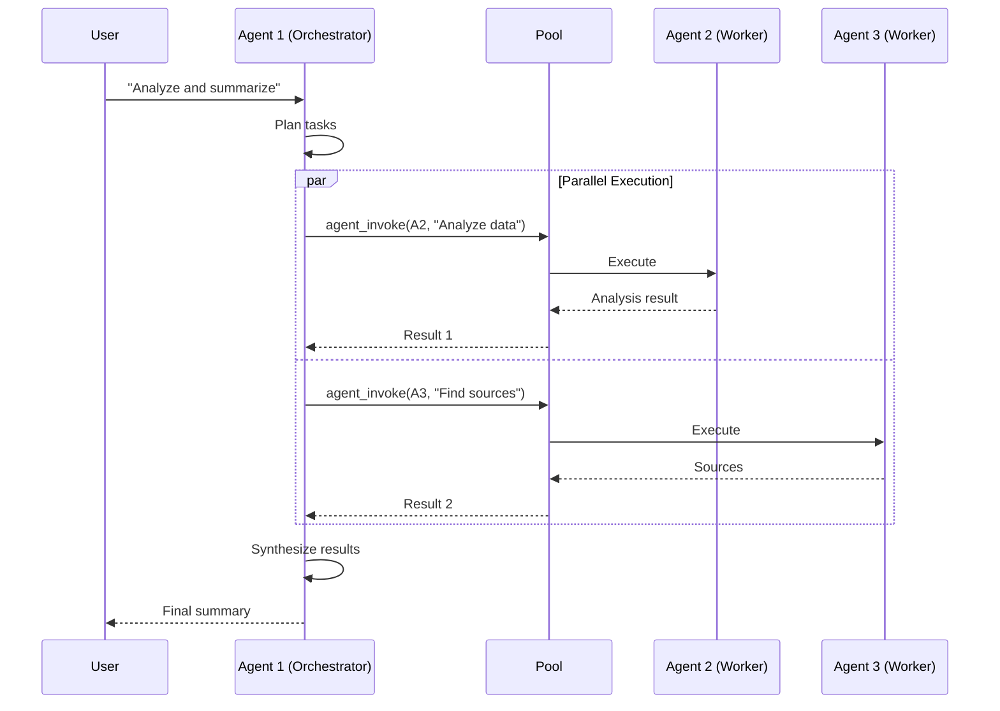
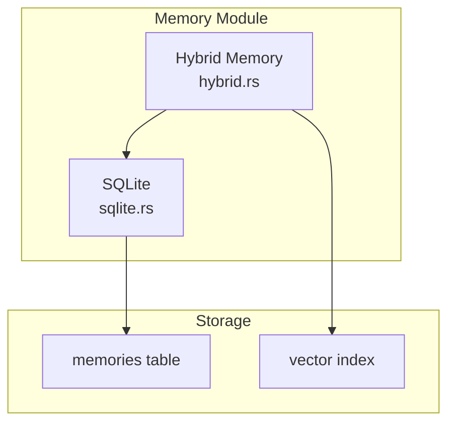

# Pekobot Architecture

This document describes the internal architecture of Pekobot, explaining how the different components work together.

**Last Updated:** 2026-03-14  
**Version:** v0.6.0 (post GAP-007)

---

## Table of Contents

1. [High-Level Architecture](#high-level-architecture)
2. [Component Overview](#component-overview)
3. [Recent Architecture Changes](#recent-architecture-changes)
4. [Data Flow](#data-flow)
5. [Module Details](#module-details)
6. [Agent Lifecycle](#agent-lifecycle)
7. [A2A Protocol & Agent Messaging](#a2a-protocol--agent-messaging)
8. [Session System](#session-system)
9. [MCP Integration](#mcp-integration)
10. [Skills System](#skills-system)
11. [Memory System](#memory-system)
12. [Identity System](#identity-system)

---

## High-Level Architecture



---

## Component Overview

| Component | Purpose | Key Files | Status |
|-----------|---------|-----------|--------|
| **Agent** | Single agent runtime with lifecycle | `src/agent/` | ✅ Stable |
| **Agent Pool** | Multi-agent management | `src/agent/pool.rs` | ✅ GAP-005 |
| **Event Router** | Event routing and subscription | `src/orchestration/router.rs` | ✅ GAP-004 |
| **Session Manager** | Session lifecycle and routing | `src/session/` | ✅ GAP-003 |
| **MCP Manager** | Model Context Protocol | `src/mcp/` | ✅ GAP-001 |
| **Skills Registry** | Documentation-driven skills | `src/skills/` | ✅ GAP-007 |
| **Identity** | DID and key management | `src/identity/` | ✅ Stable |
| **Memory** | SQLite persistence | `src/memory/` | ✅ Stable |
| **Providers** | LLM integrations | `src/providers/` | ✅ 15 providers |
| **Tools** | Agent capabilities | `src/tools/` | ✅ 18 tools |
| **Channels** | User interfaces | `src/channels/` | ✅ 7 channels |
| **Cron/Daemon** | Scheduled execution | `src/cron/`, `src/daemon/` | ✅ GAP-006 |

---

## Recent Architecture Changes

### GAP-001: MCP Support (Completed)

Pekobot now supports the Model Context Protocol (MCP) for external tool capabilities:



**Key Features:**
- Stdio and SSE transport
- Automatic tool discovery
- Health monitoring and reconnection
- Full CLI management

### GAP-003: Session Overlays (Completed)

Advanced session management with overlay system:



**Key Features:**
- Session forking for parallel exploration
- Session spawning for sub-agents
- Session merging for result consolidation
- JSONL-based storage

### GAP-004: Event Router (Completed)

Central event routing system:



### GAP-005: Agent-to-Agent Messaging (Completed)

Direct agent invocation via `agent_invoke` tool:



**Modes:**
- **Sync:** Block until response (with timeout)
- **Async:** Return receipt, result via event

### GAP-007: Skills System (Completed)

Documentation-driven skills:



**Format:**
```yaml
---
name: github
description: GitHub CLI operations
tags: [devops]
---

# GitHub Skill
...
```

---

## Data Flow

### Single Agent Execution



### Multi-Agent with Invoke



---

## Module Details

### Agent Pool

The agent pool manages multiple agent lifecycles:

```rust
pub struct AgentPool {
    agents: HashMap<String, PoolAgentEntry>,
    channels: HashMap<String, mpsc::Channel>,
}

impl AgentPool {
    pub fn get(&self, did: &str) -> Option<AgentHandle>;
    pub fn list(&self) -> Vec<PoolAgentInfo>;
    pub async fn stop(&mut self, did: &str) -> Result<()>;
}
```

### MCP Manager

Manages external MCP server lifecycle:

```rust
pub struct McpManager {
    clients: HashMap<String, McpClient>,
    config: McpConfig,
}

impl McpManager {
    pub async fn start_server(&self, name: &str) -> Result<()>;
    pub async fn list_tools(&self) -> Vec<Tool>;
    pub async fn call_tool(&self, name: &str, params: Value) -> Result<Value>;
}
```

### Skills Registry

Loads and manages skills from SKILL.md files:

```rust
pub struct SkillsRegistry {
    skills: HashMap<String, Skill>,
    skills_dir: PathBuf,
}

pub struct Skill {
    pub name: String,
    pub description: String,
    pub file_path: PathBuf,
    pub tags: Vec<String>,
}
```

---

## Agent Lifecycle

```mermaid
stateDiagram-v2
    [*] --> Initializing: Agent::new()
    
    Initializing --> Idle: start()
    Initializing --> Error: init_failure
    
    Idle --> Busy: execute()
    Idle --> Paused: pause()
    Idle --> ShuttingDown: stop()
    
    Busy --> Idle: task_complete
    Busy --> Error: task_failure
    Busy --> ShuttingDown: stop()
    
    Paused --> Idle: resume()
    Paused --> ShuttingDown: stop()
    
    Error --> Idle: recover()
    Error --> ShuttingDown: stop()
    
    ShuttingDown --> [*]: cleanup_complete
```

### State Transitions

| From | To | Trigger | Description |
|------|-----|---------|-------------|
| `Initializing` | `Idle` | `start()` | Agent ready |
| `Idle` | `Busy` | `execute()` | Processing |
| `Busy` | `Idle` | Complete | Ready next |
| `Busy` | `ShuttingDown` | `stop()` | Emergency stop |

---

## A2A Protocol & Agent Messaging

### Message Types

| Type | Purpose | Direction |
|------|---------|-----------|
| `Intent` | Initiate action | Any → Any |
| `Task` | Execute work | Parent → Child |
| `Update` | Progress update | Child → Parent |
| `Complete` | Task done | Child → Parent |
| `Query` | Information request | Any → Any |
| `Response` | Query answer | Any → Any |

### Agent Invoke Tool

The `agent_invoke` tool provides direct agent-to-agent communication:

```json
{
  "tool": "agent_invoke",
  "params": {
    "target": "agent-did-or-name",
    "message": "Task description",
    "mode": "sync",
    "timeout_ms": 30000
  }
}
```

---

## Session System

### Session Types

| Type | Use Case | Persistence |
|------|----------|-------------|
| `Base` | Normal conversation | Yes |
| `Spawn` | Sub-agent execution | Configurable |
| `Fork` | Parallel exploration | No |
| `Merge` | Result consolidation | Yes |

### Session Key Format

```
{agent_did}:{peer_type}:{peer_id}:{scope}:{date}

Examples:
- did:pekobot:...:main:dm:owner:2026-03-14
- did:pekobot:...:spawn:task-123:2026-03-14
- did:pekobot:...:fork:exploration-1:2026-03-14
```

---

## MCP Integration

### Supported Transports

| Transport | Use Case | Status |
|-----------|----------|--------|
| Stdio | Local subprocess | ✅ |
| SSE | HTTP+Server-Sent Events | ✅ |
| In-Memory | Testing | ✅ |

### MCP CLI Commands

```bash
pekobot mcp list          # List configured servers
pekobot mcp add <name>    # Add MCP server
pekobot mcp start <name>  # Start server
pekobot mcp stop <name>   # Stop server
pekobot mcp test <name>   # Test connection
```

---

## Skills System

### Skill Discovery

Skills are loaded from `~/.pekobot/skills/`:

```
~/.pekobot/skills/
├── github/SKILL.md
├── docker/SKILL.md
└── deploy/SKILL.md
```

### Skill Format

```markdown
---
name: github
description: GitHub CLI operations
tags: [devops, git]
---

# GitHub Skill

Use this skill when working with GitHub.

## Common Commands

```bash
gh pr list
gh issue create --title "Bug" --body "Description"
```
```

### System Prompt Integration

Skills appear in system prompt as:

```
## Skills (mandatory)
Before replying: scan <available_skills> <description> entries.

<available_skills>
- github: GitHub CLI operations (location: ~/.pekobot/skills/github/SKILL.md)
- docker: Docker container management (location: ~/.pekobot/skills/docker/SKILL.md)
</available_skills>
```

---

## Memory System

### Architecture



### Memory Scopes

| Scope | Visibility | Use Case |
|-------|------------|----------|
| `Agent` | Single agent | Agent-specific knowledge |
| `Tenant` | Tenant-wide | Shared within organization |
| `Local` | Instance | Local-only data |
| `Network` | Coneko network | Cross-network shared |
| `System` | Global | System-wide defaults |

---

## Identity System

### DID Format

```
did:pekobot:{scope}:{tenant}:{identifier}

Examples:
- did:pekobot:local:default:abc123...
- did:pekobot:tenant:acme:def456...
- did:pekobot:global::ghi789...
```

### Key Management

- ed25519 key pairs
- SQLite-backed storage
- Password-protected (optional)
- DID-based addressing

---

## Development Guidelines

### Adding New Features

1. Check existing GAPs in `issues/`
2. Follow the architecture patterns above
3. Maintain test coverage (aim for >80%)
4. Update documentation

### Code Quality

```bash
# Before committing
cargo fmt
cargo clippy --lib
cargo test --lib
```

See [REFACTOR-002](../issues/REFACTOR-002-code-quality-plan.md) for current code quality initiatives.

---

## References

- [Grand Architecture](../../GRAND_ARCHITECTURE.md)
- [GAP Registry](../../issues/index.md)
- [MCP Documentation](../MCP.md)
- [OpenClaw Comparison](./OPENCLAW_COMPARISON.md)
