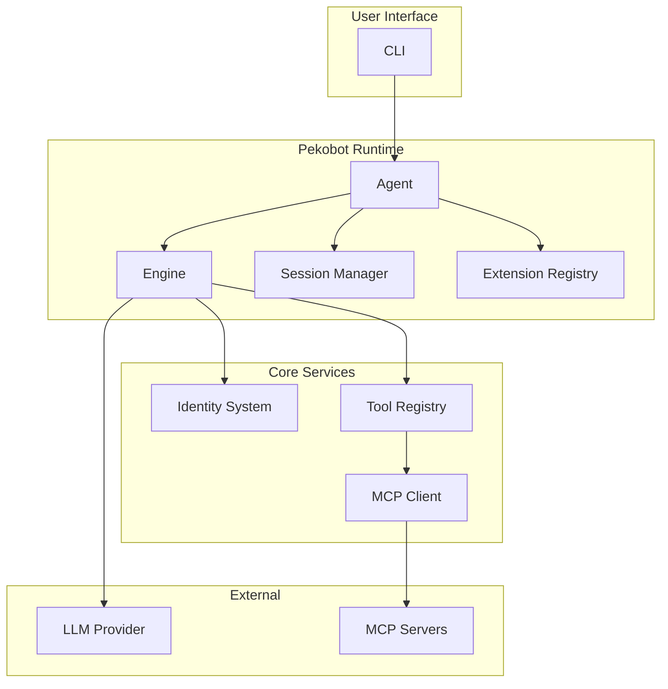
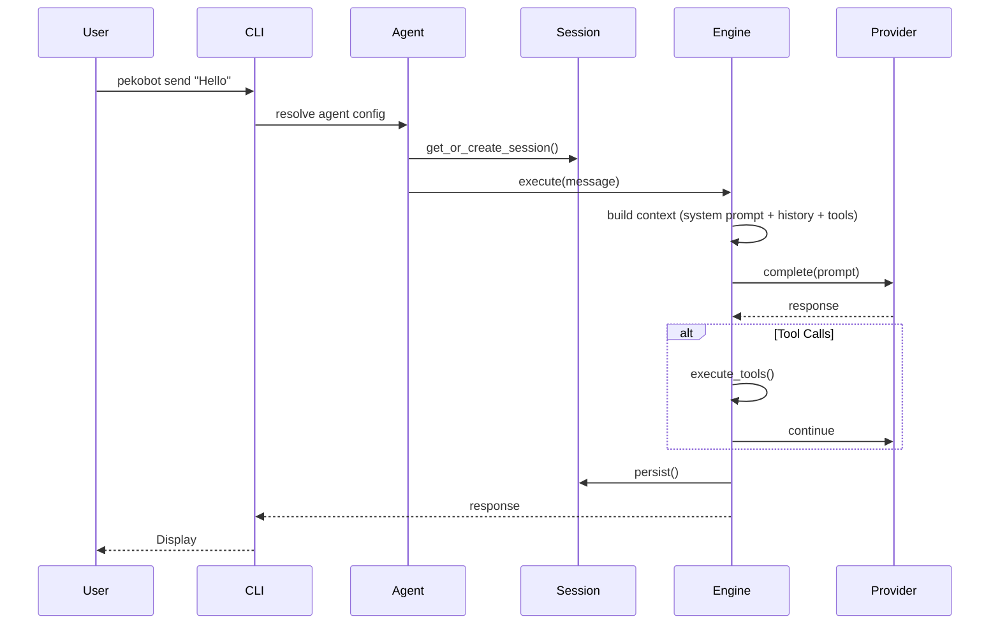
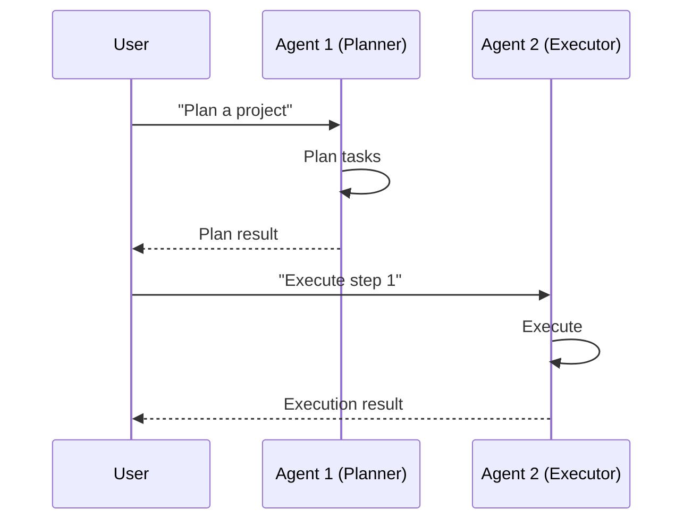
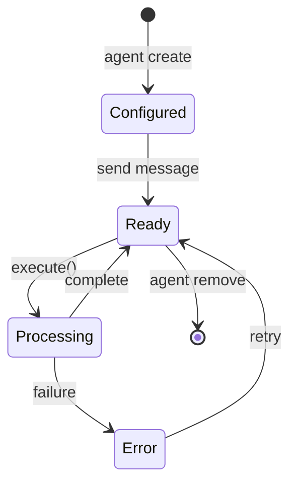

# Pekobot Architecture

This document describes the internal architecture of Pekobot, explaining how the different components work together.

**Last Updated:** 2026-05-05  
**Version:** v0.1.0

---

## Table of Contents

1. [High-Level Architecture](#high-level-architecture)
2. [Component Overview](#component-overview)
3. [Data Flow](#data-flow)
4. [Module Details](#module-details)
5. [Agent Lifecycle](#agent-lifecycle)
6. [Session System](#session-system)
7. [MCP Integration](#mcp-integration)
8. [Extensions System](#extensions-system)
9. [Identity System](#identity-system)

---

## High-Level Architecture



---

## Component Overview

| Component | Purpose | Key Files | Status |
|-----------|---------|-----------|--------|
| **Agent** | Single agent runtime with lifecycle | `src/agent/` | ✅ Stable |
| **Engine** | Agentic loop, event processing, streaming | `src/engine/` | ✅ Stable |
| **Session** | Session storage, overlays, JSONL | `src/session/` | ✅ Stable |
| **MCP** | Model Context Protocol support | `src/mcp/` | ✅ Stable |
| **Extensions** | Unified Extension Architecture | `src/extensions/` | ✅ Stable |
| **Identity** | DID and key management | `src/identity/` | ✅ Stable |
| **Providers** | LLM integrations | `src/providers/` | ✅ Multiple providers |
| **Tools** | Tool framework | `src/tools/` | ✅ Stable |
| **Team** | Multi-agent team runtime | `src/team/` | ✅ Stable |
| **Cron/Daemon** | Scheduled execution | `src/cron/`, `src/daemon/` | ✅ Stable |
| **Commands** | CLI command handlers | `src/commands/` | ✅ Stable |
| **Common** | Shared utilities, registry, services | `src/common/` | ✅ Stable |
| **Types** | Core type definitions | `src/types/` | ✅ Stable |
| **IPC** | Inter-process communication | `src/ipc/` | ✅ Stable |
| **Portable** | Portable agent packages | `src/portable/` | ✅ Stable |
| **Image** | Agent image building | `src/image/` | ✅ Stable |
| **Prompt** | Prompt construction | `src/prompt/` | ✅ Stable |
| **Runtime** | Shared runtime components | `src/runtime/` | ✅ Stable |
| **Compaction** | Session compaction | `src/compaction/` | ✅ Stable |
| **Observability** | Logging, metrics | `src/observability/` | ✅ Stable |

---

## Data Flow

### Single Agent Execution



### Multi-Agent with Teams



---

## Module Details

### Agent Module (`src/agent/`)

The agent module handles agent runtime, lifecycle, registry, and subagent execution.

Key files:
- `src/agent/agent.rs` — Core agent struct
- `src/agent/lifecycle.rs` — Agent lifecycle management
- `src/agent/registry.rs` — Agent registry

### Engine Module (`src/engine/`)

The engine implements the agentic loop, event processing, streaming, and state machine.

Key files:
- `src/engine/loop_v4.rs` — Main execution loop
- `src/engine/input.rs` — Input types
- `src/engine/events.rs` — Event types and routing
- `src/engine/execution.rs` — Tool execution

### Session Module (`src/session/`)

Sessions are stored as JSONL files with overlay support.

Key files:
- `src/session/jsonl.rs` — JSONL storage
- `src/session/manager.rs` — Session lifecycle
- `src/session/overlay.rs` — Session overlays

### Extensions Module (`src/extensions/`)

The Unified Extension Architecture handles skills, MCP, tools, channels, and hooks.

Key files:
- `src/extensions/core/` — Core extension registry and types
- `src/extensions/adapters/` — Adapters for builtin tools, MCP, skills
- `src/extensions/services/` — Extension services

### MCP Module (`src/mcp/`)

MCP client for connecting to external MCP servers.

Key files:
- `src/mcp/client.rs` — MCP protocol client
- `src/mcp/manager.rs` — MCP server management
- `src/mcp/transport.rs` — Transport implementations

---

## Agent Lifecycle



### State Transitions

| From | To | Trigger | Description |
|------|-----|---------|-------------|
| `Configured` | `Ready` | First message | Agent initialized |
| `Ready` | `Processing` | `execute()` | Processing message |
| `Processing` | `Ready` | Complete | Ready for next |
| `Processing` | `Error` | Failure | Error occurred |
| `Error` | `Ready` | Retry | Recovered |

---

## Session System

### Session Types

| Type | Use Case | Persistence |
|------|----------|-------------|
| `Base` | Normal conversation | Yes |
| `Branch` | Forked exploration | Yes |

### Session Key Format

```
{agent_did}:{peer_type}:{peer_id}:{scope}:{date}

Examples:
- did:pekobot:...:main:dm:owner:2026-05-05
- did:pekobot:...:branch:exploration-1:2026-05-05
```

### Session Operations

Sessions support the following operations:
- **List** — List all sessions for an agent
- **Show** — View session history
- **Branch** — Create a copy of a session
- **Switch** — Change the active session
- **Compact** — Summarize old messages
- **Remove** — Delete a session

---

## MCP Integration

### Supported Transports

| Transport | Use Case | Status |
|-----------|----------|--------|
| Stdio | Local subprocess | ✅ |
| SSE | HTTP+Server-Sent Events | ✅ |

### MCP Management

MCP servers are managed through the `ext` command:

```bash
pekobot ext install <mcp-extension>
pekobot ext start <mcp-extension>
pekobot ext stop <mcp-extension>
pekobot ext status <mcp-extension>
```

---

## Extensions System

The Unified Extension Architecture provides a single system for managing:
- **Skills** — Documentation-driven capabilities
- **MCP** — External tool servers
- **Tools** — Built-in and custom tools
- **Channels** — Input/output interfaces
- **Hooks** — Event-driven triggers

### Extension Lifecycle

```bash
# Install an extension
pekobot ext install <path-or-url>

# List installed extensions
pekobot ext list

# Enable/disable capabilities
pekobot ext enable <capability>
pekobot ext disable <capability>

# Configure an extension
pekobot ext config <extension>

# Start/stop background runtimes
pekobot ext start <extension>
pekobot ext stop <extension>
```

---

## Identity System

### DID Format

```
did:pekobot:{scope}:{tenant}:{identifier}

Examples:
- did:pekobot:local:default:abc123...
- did:pekobot:tenant:acme:def456...
- did:pekobot:global::ghi789...
```

### Key Management

- ed25519 key pairs
- SQLite-backed storage
- Password-protected (optional)
- DID-based addressing

---

## Development Guidelines

### Adding New Features

1. Check existing issues in `issues/`
2. Follow the architecture patterns above
3. Maintain test coverage
4. Update documentation

### Code Quality

```bash
# Before committing
cargo fmt
cargo clippy --lib
cargo test --lib
```

---

## References

- [Contributor Guide](./CONTRIBUTOR_GUIDE.md)
- [MCP Documentation](../MCP.md)
